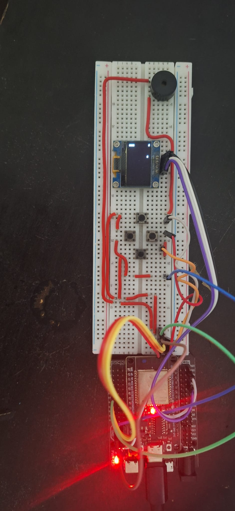

#THEGAMEPLAYER

A low-cost, handheld multi-game gaming console designed for a single-user experience. 

### System Concept & Objectives

The goal of this personal project is to build a compact, budget-friendly console that hosts multiple playable games within a single hardware setup.

### User Interface & Control Logic

The system utilizes a four-button navigation layout to access games without requiring complex hardware menus:

* **Power On / Menu Access:**(Planned) The user presses **Button 1 and Button 2 simultaneously** to wake the system and open the main game selection menu.
* **Menu Navigation:** 
  - Press **ButtonL** to move the cursor Left.
  - Press **ButtonR** to move the cursor Right.
  - Press **ButtonUp** to move the cursor Up.
  - Press **ButtonDn** to move the cursor Down.
* **Game Selection:**(Planned) Press **Button 1 and Button 2 simultaneously** to confirm and boot into the selected game.

### Software Setup(As of 20/05/2026)
* Arduino IDE(Programming Software)
* Libraries:
  - U8g2 by Oliver Kraus(display driver)
  - Wire built-in(I2C communication)

 
### Hardware Setup(As of 20/05/2026)

* 1 x Arduino Nano
* 1 x 0.96" OLED Module 4-pin IIC 3.3-5V (SSD1315)
* 2 x Pushbuttons (N.O)
* 8 x Jumperwires
* 1 x Breadboard

### Hardware v1 Photo(Taken on 31/05/2026)

### Hardware Setup Update (As of 31/05/2026)

**What's new:** Added an additional 2 pushbuttons as when i was playing the game with just 2 pushbuttons where left meant left in the snakes perspective and not the users perspective which made it harder to play and make the snake move in the desired direction but now with 4 buttons for 4 directions(Up,Down,Left,Right) its easier to maneuver from the users perspecitve where the top button meant move up, middle left button meant turn left, middle right button meant turn right and the bottom at the very bottom meant move down

* 1 x Arduino Nano
* 1 x 0.96" OLED Module 4-pin IIC 3.3-5V (SSD1315)
* 4 x Pushbuttons (N.O)
* 8 x Jumperwires
* 1 x Breadboard
* assorted wires

### Hardware v2 Photo(Taken on 31/05/2026)

### Hardware Setup Update (As of 01/06/2026)

**What's new:** Added buzzer to give a better user feel

* 1 x Arduino Nano
* 1 x 0.96" OLED Module 4-pin IIC 3.3-5V (SSD1315)
* 4 x Pushbuttons (N.O)
* 8 x Jumperwires
* 1 x Breadboard
* 1 x passive buzzer
* assorted wires

### Hardware v3 Photo(Taken on 01/06/2026) 

### Hardware Setup Update (As of 14/06/2026)

**What's new:** Changed the microcontroller from Arduino nano to ESP32.The reason is the nano has limitied space and the current games Ballie and Snake are taking up alot of space where the Snake takes upto 87% and Ballie takes upto 77% of the dynamic memory

* 1 x ESP32 WROOM 32
* 1 x ESP32 Expansion Board
* 1 x 0.96" OLED Module 4-pin IIC 3.3-5V (SSD1315)
* 4 x Pushbuttons (N.O)
* 1 x Breadboard
* 1 x passive buzzer
* assorted wires
* assorted Jumperwires

### Hardware v4 Photo(Taken on 14/06/2026) 

