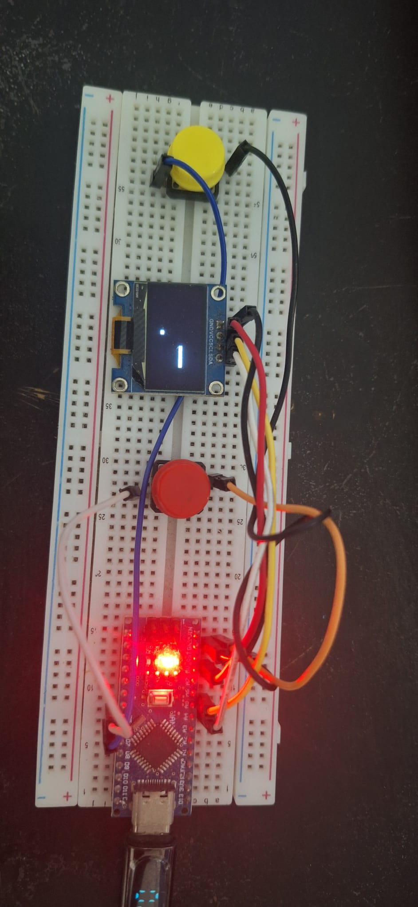
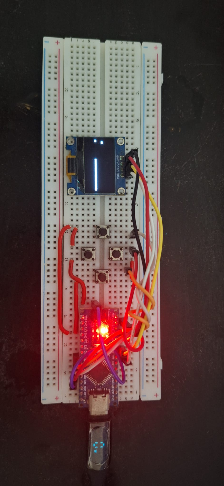
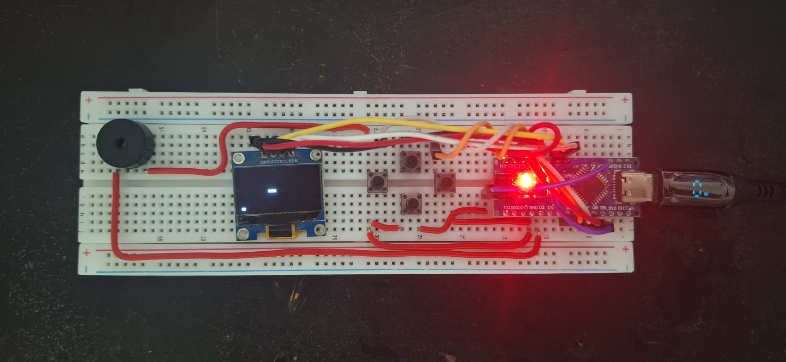

#THEGAMEPLAYER

A low-cost, handheld multi-game gaming console designed for a single-user experience. 

### System Concept & Objectives

The goal of this personal project is to build a compact, budget-friendly console that hosts multiple playable games within a single hardware setup.

### User Interface & Control Logic

The system utilizes a two-button navigation layout to access games without requiring complex hardware menus:

* **Power On / Menu Access:** The user presses **Button 1 and Button 2 simultaneously** to wake the system and open the main game selection menu.
* **Menu Navigation:** 
  - Press **Button 1** to move the menu cursor to the **Left**.
  - Press **Button 2** to move the menu cursor to the **Right**.
* **Game Selection:** Press **Button 1 and Button 2 simultaneously** to confirm and boot into the selected game.

### Software Setup(As of 20/05/2026)
* Arduino IDE(Programming Software)
* Libraries:
  - U8g2 by Oliver Kraus(display driver)
  - Wire built-in(I2C communication)

 
### Hardware Setup(As of 20/05/2026)

* 1 x Arduino Nano
* 1 x 0.96" OLED Module 4-pin IIC 3.3-5V (SSD1315)
* 2 x Pushbuttons (N.O)
* 8 x Jumperwires
* 1 x Breadboard

### Hardware v1 Photo(Takes on 31/05/2026)

### Hardware Setup Update (As of 31/05/2026)

* 1 x Arduino Nano
* 1 x 0.96" OLED Module 4-pin IIC 3.3-5V (SSD1315)
* 4 x Pushbuttons (N.O)
* 8 x Jumperwires
* 1 x Breadboard
* assorted wires

### Hardware v2 Photo(Takes on 31/05/2026)

### Hardware Setup Update (As of 01/06/2026)

* 1 x Arduino Nano
* 1 x 0.96" OLED Module 4-pin IIC 3.3-5V (SSD1315)
* 4 x Pushbuttons (N.O)
* 8 x Jumperwires
* 1 x Breadboard
* 1 x passive buzzer
* assorted wires

### Hardware v3 Photo(Takes on 01/06/2026) 

